# Добавление изменений в базу на GitHub

## Основные термины

- **База знаний** - это база знаний сообщества "Obsidian Чат" по программе `Obsidian`, онлайн доступ к которой доступен по ссылке <https://publish.obsidian.md/obsidian-russian-community/>. По адресу <https://github.com/mnaoumov/obsidian-community-vault> находится её хранилище, которое можно скачать.
- [GitHub](https://github.com/) — это облачный хостинг репозиториев `Git`, или папок, где `Git` отслеживает изменения.
- **Репозиторий** (`Repository`) — папка с вашим проектом, где лежат файлы, иконки программы, разные картинки. В `GitHub` у каждого репозитория есть страница с описанием проекта.
- **Коммит** (`Commit`) — внесение изменений в репозиторий, чтобы их увидели другие разработчики. У каждого коммита есть временная метка и хеш-сумма.
- **Форк** (`Fork`) — копирование репозитория, обычно чужого, для продолжения разработки по другому пути. Часто бывает в опенсорсных проектах.
- **Пул-реквест** (`Pull request` или сокращенно `PR`) — предложение автору проекта своих улучшений, чтобы он залил их в исходный репозиторий.
- **Клонирование** (`Clone`) — копирование репозитория из `GitHub` на жёсткий диск. При клонировании на компьютер пишется вся история версий, все ветки. Если кто-то вносит изменения в репозиторий, вы их тоже получите. Простое копирование таких возможностей не даёт.

За некоторые из этих терминов спасибо [Яндекс Образованию](https://education.yandex.ru/journal/chto-takoe-github), где вы можете узнать ещё больше, как о `GitHub`, так и о многом другом.

## Регистрация на `GitHub`

1. Перейдите на главную страницу `GitHub` любым удобным Вам способом, например, по ссылке [GitHub](https://github.com/), и в верхнем правом углу выберите кнопку регистрации `Sign up`.
2. Последовательно введите в открывшемся окне адрес электронной почты, пароль, никнейм, который будет отображаться в качестве имени Вашего профиля `GitHub`.
3. Согласитесь/откажитесь от рекламной рассылки (на регистрацию не влияет).

4. Пройдите проверку, доказав бездушной машине, что Вы настоящий человек! Для этого решите предложенную `capture`.
5. Нажмите внизу зеленую кнопку `Create accоunt`.
6. На следующем шаге `GitHub` направит на указанную при регистрации почту цифровой код, который нужно скопировать из почты или ввести вручную в открывшееся на сайте `GitHub` окно запроса проверочного кода.

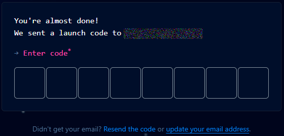

7. Далее сайт предложит Вам пройти персонализацию Вашего профиля, можете сделать это или выбрать опцию `Skip personalisation` внизу посередине страницы.
8. Поздравляем, Вы зарегистрированы на `GitHub`!
9. Бонусом `GitHub` автоматически залогинит вас в учетную запись.

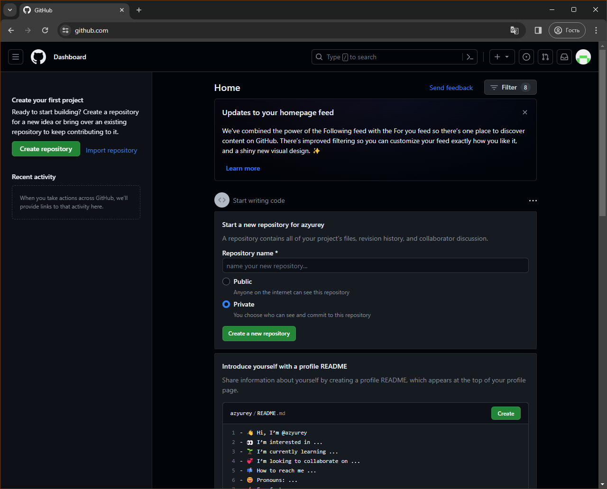

## Вход на `GitHub`

1. Перейдите на страницу главную страницу `Github` любым удобным Вам способом, например, по ссылке [GitHub](https://github.com/) и в верхнем правом углу выберите кнопку входа `Sign in`.
2. В открывшемся окне в верхней строке введите имя (никнейм) Вашей учетной записи или адрес электронной почты, указанный при регистрации.
3. В нижней строке введите пароль, нажмите зеленую кнопку `Sign in`.
4. Поздравляем, Вы залогинились на `GitHub`!

## Копирование или форк (`Fork`) репозитория

Репозиторий нашей **базы знаний** находится по адресу [obsidian-community-vault](https://github.com/mnaoumov/obsidian-community-vault), но напрямую вносить в него правки вы не можете. Чтобы добавлять или изменять файлы, репозиторий сначала нужно скопировать (`fork`) себе на аккаунт `GitHub`, для чего необходимо:

1. Открыть страницу репозитория [obsidian-community-vault](https://github.com/mnaoumov/obsidian-community-vault).
2. Вверху справа нажать кнопку `Fork`.

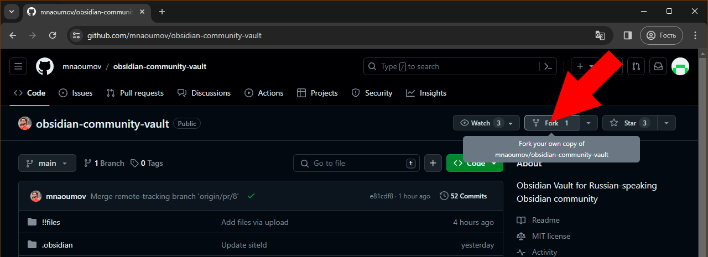

3. В открывшемся окне можно выбрать новое имя хранилища, которое будет скопировано или изменить его описание. Это не обязательно.

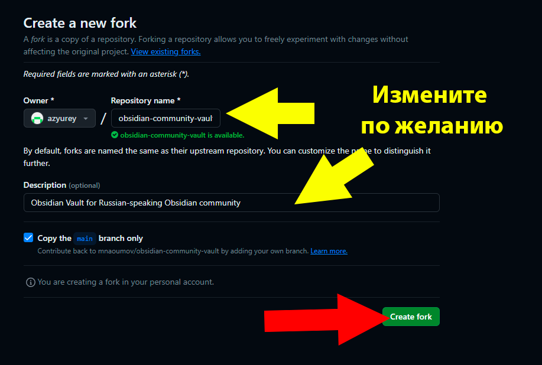

4. Нажать внизу зеленую кнопку `Create fork`.
5. Спустя какое-то время откроется ваша страница `GitHub` со скопированным репозиторием.

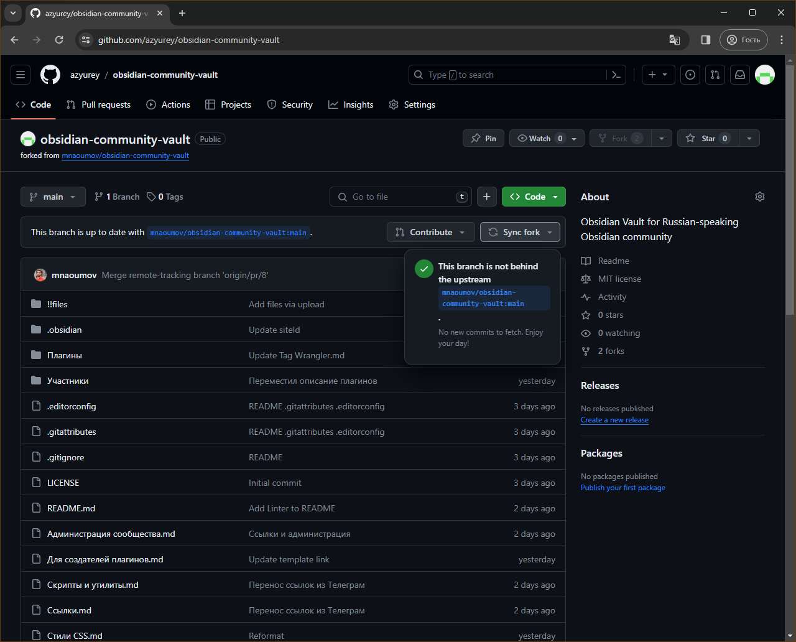

Теперь на Вашей учетной записи есть копия (`Fork`) основного хранилища, в которой вы можете вносить свои изменения.

## Внесение правок в программе `Obsidian`

Перед внесением своих правок в любой файл базы рекомендуется перезакачать актуальную версию **базы данных** себе на ПК. Для этого перейдите по основному адресу хранения базы [obsidian-community-vault](https://github.com/mnaoumov/obsidian-community-vault) и используйте зеленую кнопку `<> Code`, а в выпавшем меню - нижнюю кнопку `Download ZIP` . При этом Вы получите максимально актуальный файл-архив с хранилищем. Если этого не сделать, то вы можете использовать устаревшие файлы, в который кто-то уже может внести свои изменения, которые будут конфликтовать с вашими.

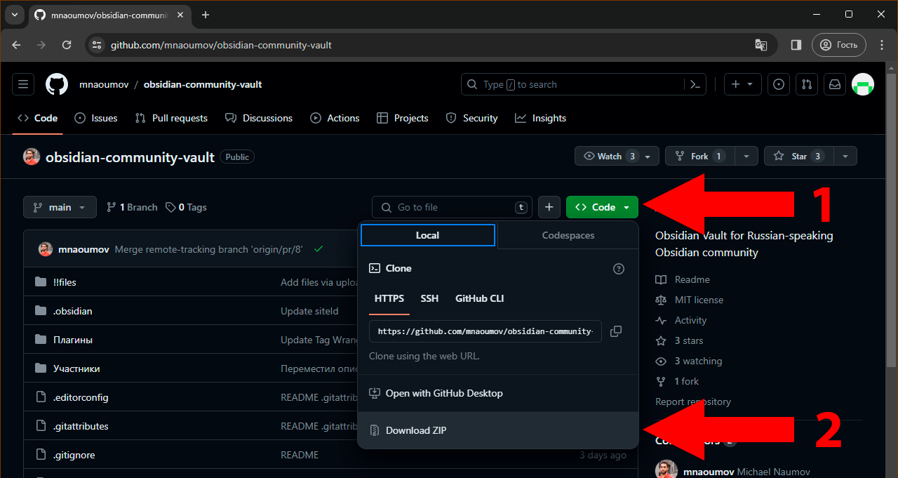

Распакуйте `ZIP`-архив в удобном для Вас месте, и в программе `Obsidian` откройте распакованную папку, как хранилище. При этом, в открывшемся окне, согласитесь с использованием плагинов (в хранилище задействован плагин [Linter](Плагины/Linter.md), который используется для приведения разметки файлов в единый вид).

Внесите ваши правки в файлы хранилища в программе `Obsidian`:

- Используйте для написания текста стандартные возможности разметки `markdown`, такие как выделение **жирным** шрифтом, *курсивом*, отображение `кода` (рекомендуется помечать как код команды `Obsidian` и сочетания клавиш для вызова функций).
- Также вы можете использовать колауты (`callouts`), блоки кода, таблицы и прочие элементы, поддерживаемые `markdown`.
- Используйте по возможности понятные всем термины и избегайте редко используемых или специфических сокращений и аббревиатур или технического сленга (или расшифруйте их при первом использовании). Ваш текст в идеале должен быть понятен без дополнительных пояснений.
- Если требуется, добавьте скриншоты/картинки или другие файлы с пояснением описываемых функций/возможностей/опций. Эти файлы вложений (`assets`) рекомендуется вставлять в текст с использованием копирования-вставки или перетягиванием в нужное место по тексту заметки. При этом обратите внимание, что файлы вложений по умолчанию в этом хранилище размещаются в папке `!!files`. Для удобства рекомендуется переименовывать файлы вложений по названию заметки (или описываемой функции и т.д.) с суффиксом в виде порядкового номера (`...-1`, `...-2`), это не обязательно, но облегчает дальнейшую работу с базой.
- Внешние ссылки (на сайты или видео) размещаются в виде ссылки `[название ссылки](https://путь/к/ссылке)`.
- При заполнении заметок вы можете включать в них ссылки на другие заметки или элементы хранилища. Для этого воспользуйтесь стандартными способами - перетягиванием нужного файла в текст для создания ссылки, копированием-вставкой или добавлением файла через вставку локальной ссылки `[[]]`. Обратите внимание, что в данном хранилище отключены `WIKI-ссылки`, поэтому после выбора файла ссылка вида `[[имяфайла]]` автоматически преобразуется в вид `[имяфайла](путь/к/файлу/имяфайла)`. Не нужно вручную исправлять её обратно!

> [!attention] ВНИМАНИЕ
> После внесения корректировок по тексту **обязательно** используйте в исправленной заметке команду `Ctrl+S` для того, чтобы плагин [Linter](Плагины/Linter.md) привел форматирование текста к установленному образцу.

Итак, у вас есть исправленная вами заметка (и опционально - `assets` к ней), самое время перейти к добавлению внесенных изменений в хранилище!

## Изменение файлов на `GitHub`

### Добавление новых файлов

> [!attention] ВНИМАНИЕ
> Перед любыми изменениями рекомендуется на странице репозитория **базы данных** в вашей учетной записи синхронизировать копию с основным хранилищем, для этого используйте кнопку `Sync fork`. Это обеспечивает полное совпадение файлов основного хранилища и вашей копии (`Fork`).
> 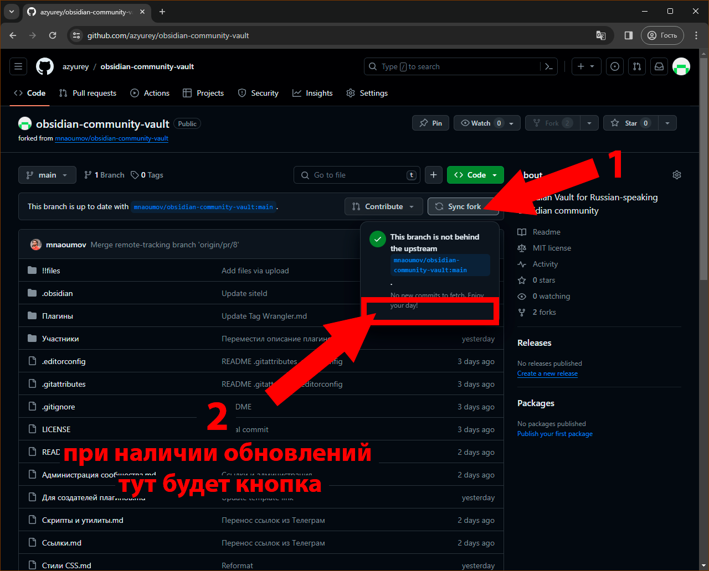

#### Создание новых файлов в репозиторий "с нуля"

1. Перейдите на свою страницу `GitHub` в скопированный репозиторий.
2. Используйте кнопку `+` и выберите `create new file`.

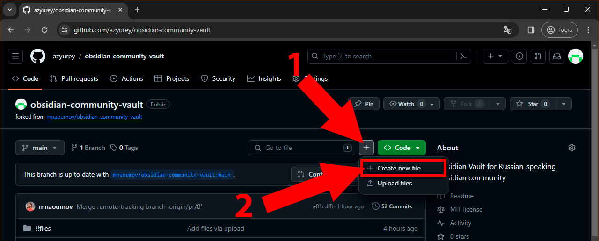

3. В открывшемся окне редактора введите желаемый текст, а в верхней части, над окном редактора укажите название файла вместе с расширением.
4. После внесения всех необходимых изменений нажмите зелёную кнопку `Commit changes...`, в открывшемся окне можете указать название коммита, по умолчанию оно заполняется сайтом по вашим действиям, а также описание коммита, где рекомендуется указать, что именно вы создали. Это не обязательно, но облегчает дальнейшую работу автора основного хранилища при проверке ваших коммитов и является правилом хорошего тона.

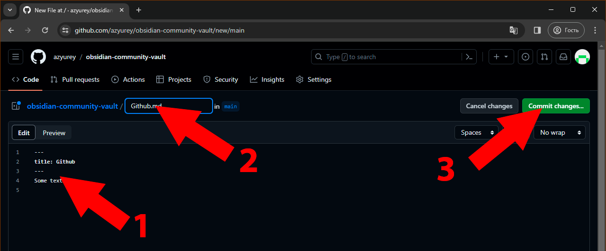

#### Добавление новых файлов

1. Перейдите на свою страницу `GitHub` в скопированный репозиторий.
2. Откройте в окне браузера репозитория ту папку, в которую вы хотите загрузить файл
3. Используйте кнопку `Add file` вверху справа и потом `Upload files`.

4. Перетащите файлы, которые вы хотите добавить в открывшееся окно или используйте кнопку `choose your files` для открытия окна выбора.

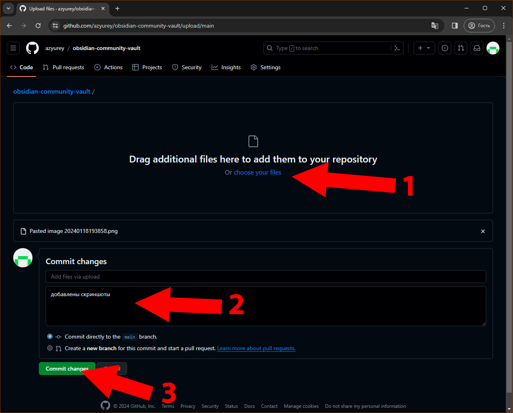

5. В нижней части открывшегося окне можете указать название коммита, по умолчанию оно заполняется сайтом по вашим действиям, а также описание коммита, где рекомендуется указать, что именно вы добавили. Это не обязательно, но облегчает дальнейшую работу автора основного хранилища при проверке ваших коммитов и является правилом хорошего тона.
6. После добавления всех файлов в эту папку нажмите зелёную кнопку `Commit changes`.

> [!attention] ВНИМАНИЕ
> 1. Для удаления ошибочно добавленных файлов или папок используйте функцию `Delete file` или `Delete folder`, которая находится в меню кнопки "трех точек" вверху справа окна GitHub.
> 2. Для перемещения файла по репозиторию нужно открыть его и переименовать в строке имени так, чтобы имя файла содержало новый путь к его расположению.
> 3. Все процедуры изменения/добавления/удаления файлов подтверждаются кнопкой `Commit changes`.

### Внесение исправлений в уже имеющиеся файлы

1. Найдите в вашем репозитории и откройте файл, в который вы хотите внести изменения.
2. Используйте кнопку с изображением ручки для открытия режима редактирования. Файлы `.md` открываются встроенным в `GitHub` редактором без проблем.

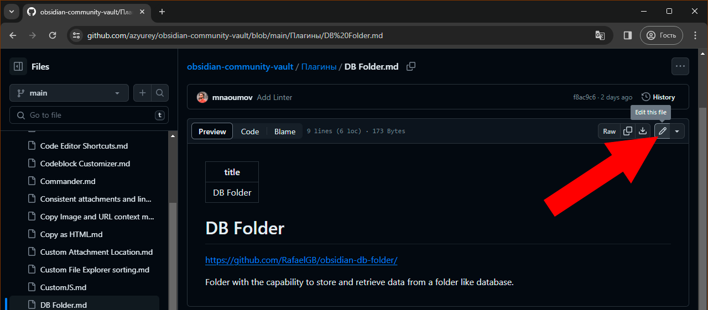

3. Внесите правки по тексту вручную.
4. Или откройте окно `Obsidian`, скопируйте и вставьте нужный текст из `Obsidian` в `GitHub` (можете включить для удобства в `Obsidian` режим просмотр кода).
5. После внесения всех исправлений по тексту нажмите зелёную кнопку `Commit changes...`.

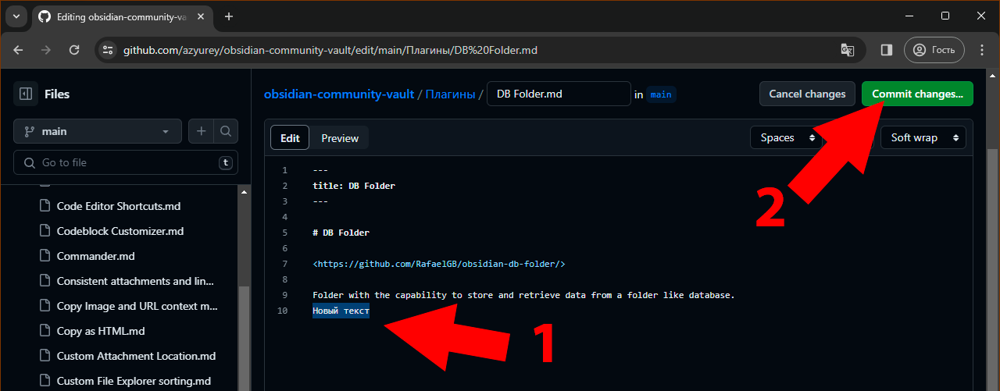

6. В открывшемся окне можете указать название коммита, по умолчанию оно заполняется сайтом по вашим действиям, а также описание коммита, где рекомендуется указать, что именно вы сделали в измененном файле. Это не обязательно, но облегчает дальнейшую работу автора основного хранилища при проверке ваших коммитов и является правилом хорошего тона.

Если в процессе потребуется снова внести изменения в тот же файл, повторите операции.

Поздравляем, вы изменили файлы в своем репозитории! Теперь ваша копия хранилища (`Fork`) отличается от основного на внесённые вами изменения (как минимум) и теперь осталось только передать изменения на рассмотрение автору основного хранилища, так что самое время сделать `Pull request`.

## `Pull request`

Это завершающая (для вас) стадия внесения ваших правок в основное хранилище.

Для того, чтобы сделать `Pull request`:

1. Используйте кнопку `Contribute` в вашем хранилище.
2. Выберите `Open pull request`. Эта кнопка появляется при наличии в вашем хранилище внесенных вами изменений.

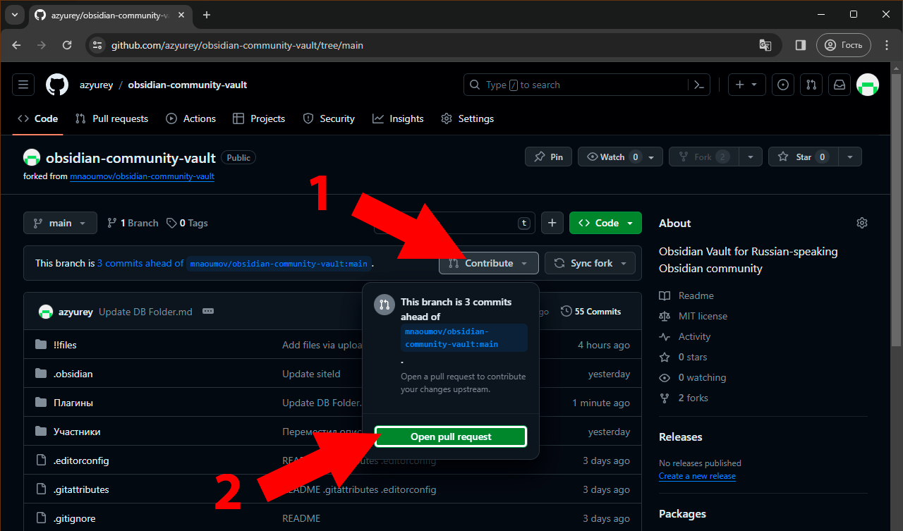

3. После этого откроется окно, в котором будут описаны и отображены все изменения, которые вы внесли в ваш репозиторий, проверьте их, после чего снова нажмите зеленую кнопку `Create pull request`.

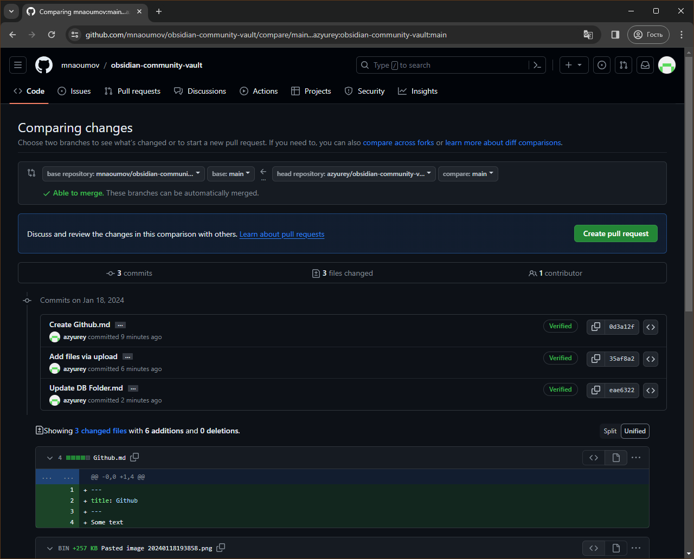

4. В открывшемся окне обязательно введите название `Pull request` и в поле ниже - краткое описание всех изменений (по желанию).

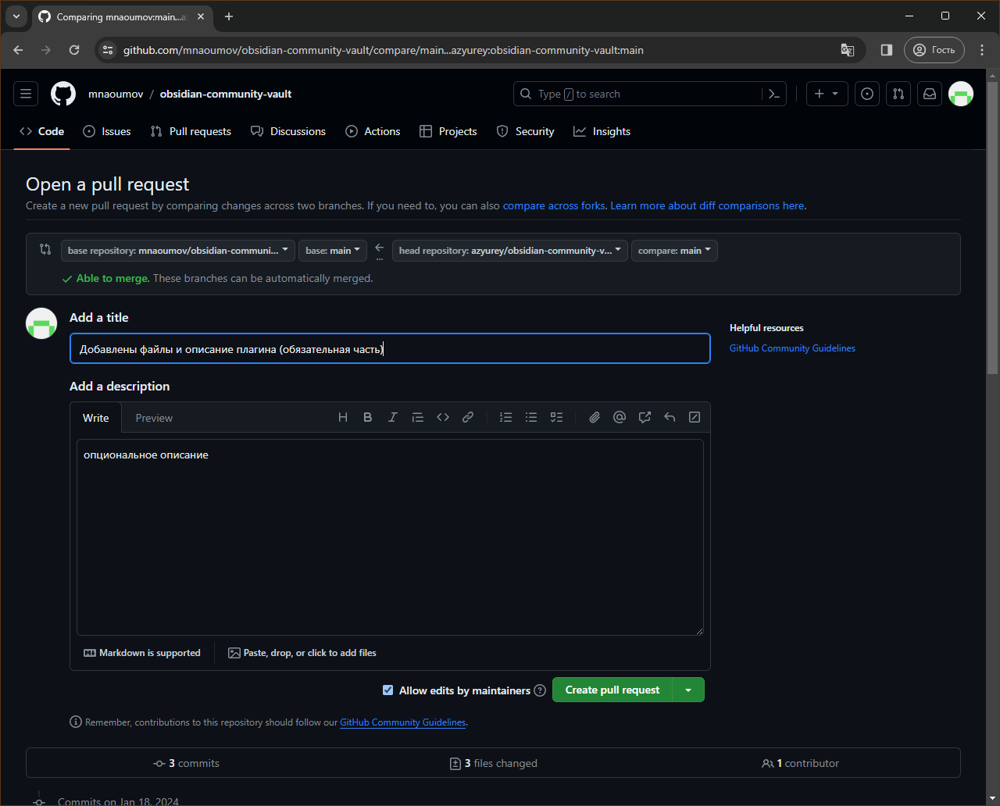

5. После ввода названия `Pull request` активируется зеленая кнопка `Create pull request` внизу, по нажатию на которую ваш `Pull request` отправится автору основного хранилища на рассмотрение.

По итогам рассмотрения ваши правки будут добавлены в основное хранилище или возвращены на доработку/отклонены.

**Поздравляем, вы великолепны!**

> [!attention] ВНИМАНИЕ
> В онлайн-версии хранилища **базы знаний** сообщества "Obsidian Чат", которая доступна по ссылке <https://publish.obsidian.md/obsidian-russian-community/>, изменения отразятся ТОЛЬКО после того, как ваши изменения (ваш `Pull request`) будут приняты хозяином основного хранилища!

